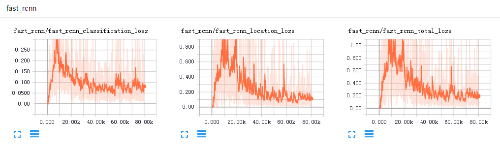
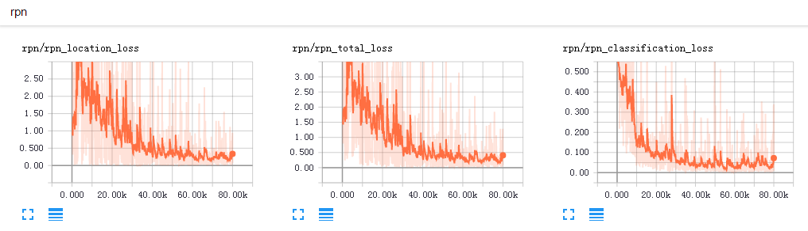
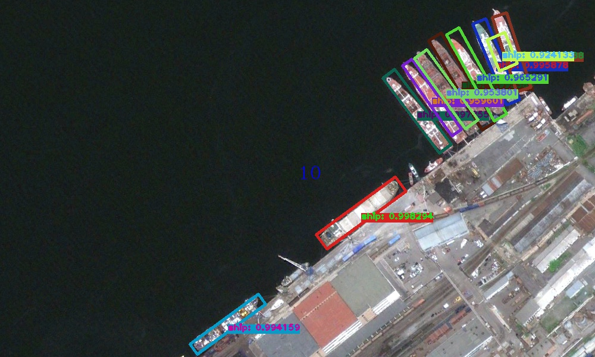
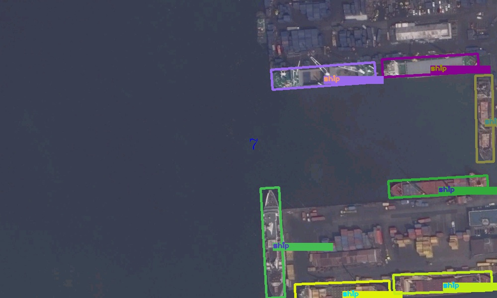
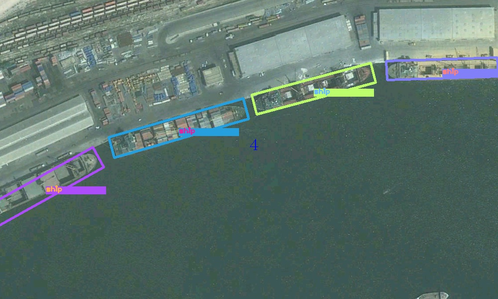
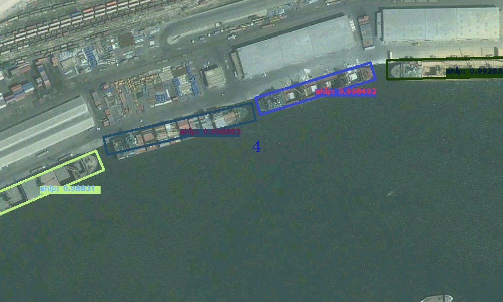
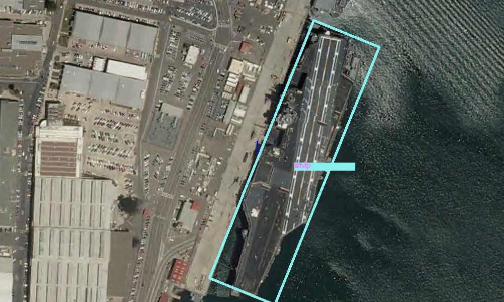

# Papers are being submitted and the complete code and instructions are will uploaded soon.Stay tuned.

A Tensorflow implementation of R-DFPN detection framework based on FPN .    
Another rotation detection method reference [R2CNN](https://github.com/yangxue0827/R2CNN_FPN_Tensorflow)

# Configuration Environment
ubuntu + python2 + tensorflow1.2 + cv2 + cuda8.0 + GeForce GTX 1080     
If you want to use cpu, you need to modify the parameters of NMS and IOU functions use_gpu = False    
You can also use docker environment, command: docker push yangxue2docker/tensorflow3_gpu_cv2_sshd:v1.0     

# Make tfrecord   
The data is VOC format, reference [here](sample.xml)     
data path format  
VOCdevkit  
>VOCdevkit_train  
>>Annotation  
>>JPEGImages   

>VOCdevkit_test   
>>Annotation   
>>JPEGImages   

python ./data/io/convert_data_to_tfrecord.py --VOC_dir='***/VOCdevkit/VOCdevkit_train/' --save_name='train' --img_format='.jpg' --dataset='ship'

# Train
1、Configure parameters in ./libs/configs/cfgs.py and modify the project's root directory    
2、Modify ./libs/lable_name_dict/***_dict.py, corresponding to the number of categories in the configuration file    
3、download pretrain weight([resnet_v1_101_2016_08_28.tar.gz](http://download.tensorflow.org/models/resnet_v1_101_2016_08_28.tar.gz) or [resnet_v1_50_2016_08_28.tar.gz](http://download.tensorflow.org/models/resnet_v1_50_2016_08_28.tar.gz)) from [here](https://github.com/yangxue0827/models/tree/master/slim), then extract to folder ./data/pretrained_weights    
4、python ./tools/train.py

# Test tfrecord     
mkdir test_result    
python ./tools/test.py 

# Test images  
put images in ./tools/inference_image, and mkdir inference_result    
python ./tools/inference.py   

# eval   
python ./tools/ship_eval.py

# Summary   
tensorboard --logdir=./output/summary/   
 
 
 

# Graph
 

# Test results   
   
   
     
   
  

    
   
     
    
     