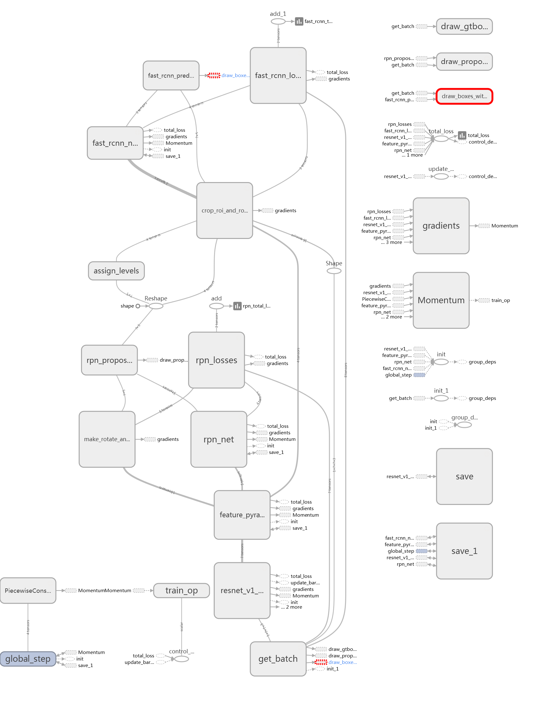
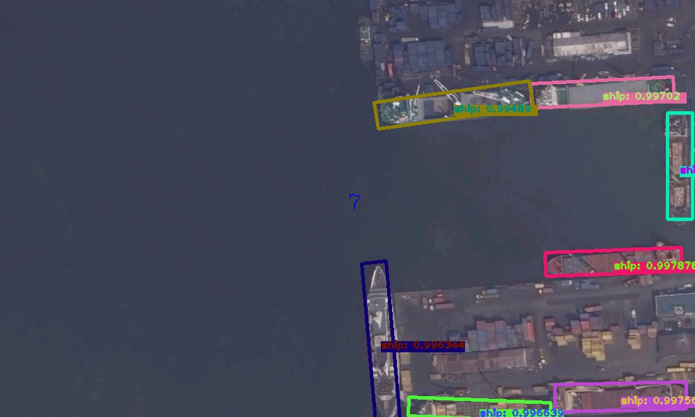
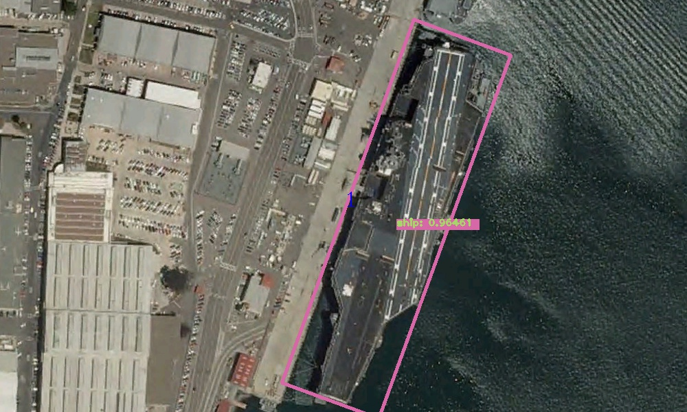

# [Rotation Dense Feature Pyramid Networks](http://www.mdpi.com/2072-4292/10/1/132)

A Tensorflow implementation of R-DFPN detection framework based on [FPN](https://github.com/yangxue0827/FPN_Tensorflow).    
Other rotation detection method reference [R2CNN](https://github.com/yangxue0827/R2CNN_FPN_Tensorflow), [RRPN](https://github.com/yangJirui/RRPN_FPN_Tensorflow) and [R2CNN_HEAD](https://github.com/yangxue0827/R2CNN_HEAD_FPN_Tensorflow)     
If useful to you, please star to support my work. Thanks.      

# Citing [R-DFPN](http://www.mdpi.com/2072-4292/10/1/132)

If you find R-DFPN useful in your research, please consider citing:

    @article{yangxue_r-dfpn:http://www.mdpi.com/2072-4292/10/1/132
        Author = {Xue Yang, Hao Sun, Kun Fu, Jirui Yang, Xian Sun, Menglong Yan and Zhi Guo},
        Title = {{R-DFPN}: Automatic Ship Detection in Remote Sensing Images from Google Earth of Complex Scenes Based on Multiscale Rotation Dense Feature Pyramid Networks},
        Journal = {Published in remote sensing},
        Year = {2018}
    }  

# Configuration Environment
ubuntu(Encoding problems may occur on windows) + python2 + tensorflow1.2 + cv2 + cuda8.0 + GeForce GTX 1080     
If you want to use cpu, you need to modify the parameters of NMS and IOU functions use_gpu = False in cfgs.py   
You can also use docker environment, command: docker pull yangxue2docker/tensorflow3_gpu_cv2_sshd:v1.0     

# Installation      
  Clone the repository    
  ```Shell    
  git clone https://github.com/yangxue0827/R-DFPN_FPN_Tensorflow.git    
  ```    

# Make tfrecord   
The image name is best in English.         
The data is VOC format, reference [here](sample.xml)     
data path format  ($DFPN_ROOT/data/io/divide_data.py)    
VOCdevkit  
>VOCdevkit_train  
>>Annotation  
>>JPEGImages   

>VOCdevkit_test   
>>Annotation   
>>JPEGImages   

  ```Shell    
  cd $R-DFPN_ROOT/data/io/    
  python convert_data_to_tfrecord.py --VOC_dir='***/VOCdevkit/VOCdevkit_train/' --save_name='train' --img_format='.jpg' --dataset='ship'   
  ```

# Demo   
1、Unzip the weight $R-DFPN_ROOT/output/res101_trained_weights/*.rar    
2、put images in $R-DFPN_ROOT/tools/inference_image   
3、Configure parameters in $R-DFPN_ROOT/libs/configs/cfgs.py and modify the project's root directory     
4、image slice          
  ```Shell    
  cd $R-DFPN_ROOT/tools
  python inference.py    
  ```    
5、big image      
  ```Shell    
  cd $FPN_ROOT/tools
  python demo.py --src_folder=.\demo_src --des_folder=.\demo_des   
  ```      

# Train
1、Modify $R-DFPN_ROOT/libs/lable_name_dict/***_dict.py, corresponding to the number of categories in the configuration file    
2、download pretrain weight([resnet_v1_101_2016_08_28.tar.gz](http://download.tensorflow.org/models/resnet_v1_101_2016_08_28.tar.gz) or [resnet_v1_50_2016_08_28.tar.gz](http://download.tensorflow.org/models/resnet_v1_50_2016_08_28.tar.gz)) from [here](https://github.com/yangxue0827/models/tree/master/slim), then extract to folder $R-DFPN_ROOT/data/pretrained_weights    
3、    
  ```Shell    
  cd $R-DFPN_ROOT/tools    
  python train.py    
  ```

# Test tfrecord     
  ```Shell    
  cd $R-DFPN_ROOT/tools     
  python test.py     
  ``` 

# eval   
  ```Shell    
  cd $R-DFPN_ROOT/tools       
  python ship_eval.py    
  ```
  
# Summary    
  ```Shell    
  tensorboard --logdir=$R-DFPN_ROOT/output/res101_summary/     
  ```  
 
 
 

# Graph
 

# Test results   
   
   
     
   
  

    
   
     
    
     